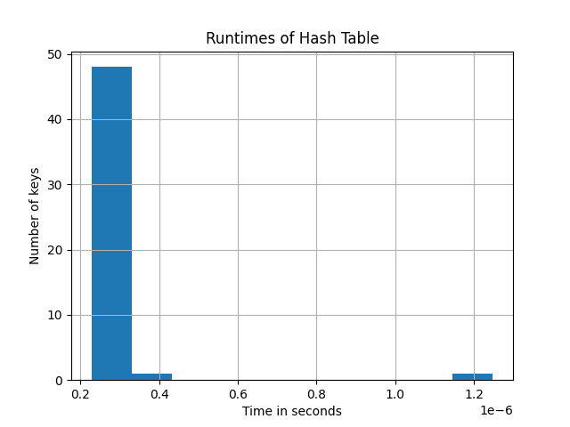

# HashTable with Open Addressing

This repository contains an implementation of a basic hash table that uses open addressing with modular arithmetic and linear probing to handle collisions.

## Overview

The hash table supports the following operations:

- **Insertion**: Inserts a numeric value into the table.
- **Search**: Retrieve a numeric value from the hash table by its value or its key (index).
- **Hashing**: Computes a hash value using the modulo operation.

### Additional Features

- **Validation**: Ensures only numeric values (int or float) are added to the hash table.
- **Collision Handling**: Uses linear probing to handle hash collisions.

## Testing

The script also contains a test section that:

1. Generates 1000 distinct random 10-digit numbers and inserts them into the hash table.
2. Tests the time required to search the hash table for 50 randomly chosen keys.
3. Visualizes the runtime results using a histogram.

## How to Run

To execute the script, ensure you have Python installed and simply run:

```
python hash_table.py
```

## Dependencies

The script depends on the following Python libraries:

- `random`: For generating random numbers.
- `timeit`: For measuring the runtime of code segments.
- `matplotlib`: For plotting the histogram.


## **Results & Discussion**

### **Hash Table Search Runtime Analysis**

Using the hash table implementation that utilizes open addressing with modular arithmetic and linear probing for collision resolution, we measured the runtime of search operations for 50 randomly selected keys. The keys were chosen from a dataset of 1000 distinct random 10-digit numbers.

The histogram below provides a distribution of these runtimes:



**Observations:**

1. **General Performance**: The majority of the search operations seem to lie in a very low time bracket, indicating that the hash table retrieval, on average, is extremely fast.

2. **Few Outliers**: There are few search operations that took slightly longer. This could be related to the linear probing mechanism of our open addressing which might have led to more probes in some searches.

3. **Consistency**: Given the uniform distribution of our random keys, it's evident that our hash table implementation is providing a consistent performance for most of the keys, as indicated by the major spike in the histogram.

### **Discussion:**

Our hash table, as visualized, is working as intended for the majority of cases. The efficiency of search operations showcases the strength of hash tables in terms of data retrieval. The open addressing mechanism, although introducing some delay in a few scenarios due to collisions, still manages to provide a quick resolution and retrieval.

**Unexpected Observations:**
One of the unexpected outcomes was the presence of few search operations that took longer than the majority. While we did anticipate some collisions given the nature of hashing, the delay caused by linear probing in those particular cases was interesting. It suggests that there were areas in the hash table that had a higher clustering of filled slots, causing the search operation to probe multiple times before finding the key.

### **Concluding Thoughts:**

While open addressing conserves space by avoiding the use of pointers and ensuring all entries are stored within the hash table itself, the linear probing technique we used can introduce slight delays when clusters form. These clusters can sometimes lead to increased search times, especially if many keys hash to the same index.

This underscores the importance of selecting appropriate collision resolution strategies. Collisions are inevitable when using hash tables; however, our choice of resolution strategy can significantly impact overall performance.